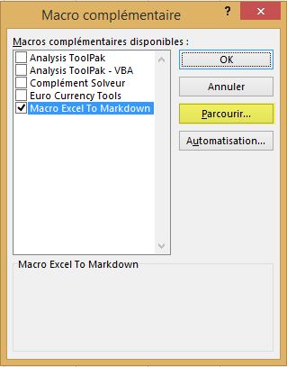
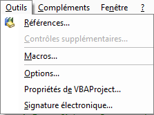
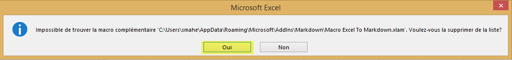

## How to Install ##

### Install Macro ###

Copy File `Macro Excel To Markdown.xlam` To 
```
C:\Users\[user]\AppData\Roaming\Microsoft\AddIns\Markdown
```

	File / Options / Add-Ins / Go...
	Fichier / Options / Compléments / Atteindre...


	Add... / Add .xlam File
	Parcourir / Add .xlam File



### Add Microsoft Form 2.0 Object Library ###

`Alt+F11`

	Tools / References




### Add Button to Ribbon ###


	File / Options / Customize Ribbon
	Fichier / Options / Personnaliser le rubban


### UnInstall Macro ###

Delete File `C:\Users\[user]\AppData\Roaming\Microsoft\AddIns\Markdown\Macro Excel To Markdown.xlam` 

**Excel**

	File / Options / Add-Ins / Go... / UnCheck `Markdown\Macro Excel To Markdown`
	Fichier / Options / Compléments / Atteindre / Décocher `Markdown\Macro Excel To Markdown`



## Credits ##

Base from [https://github.com/jensbodal/RedditTableMacro](https://github.com/jensbodal/RedditTableMacro "jensbodal/RedditTableMacro")